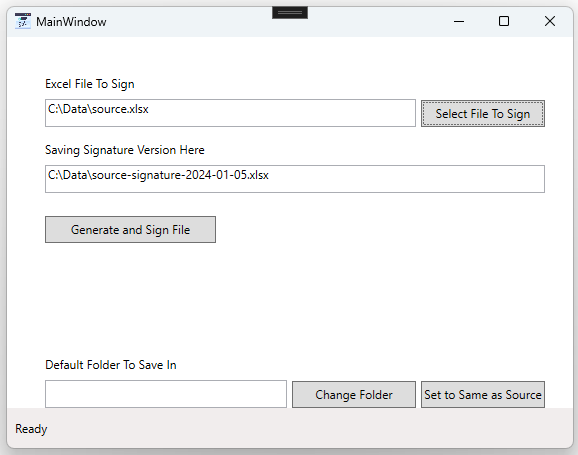

# Sign Excel Document

1. Install the application
2. Open "Sign Excel Document" from the desktop or start menu
3. Select File to Sign
4. Click Generate and Sign File

A new sheet is added to the Excel file named "Approval Signature" with an Office "signature line object" added and saved beside the source document. Complete the process by signing the document and closing Excel.

